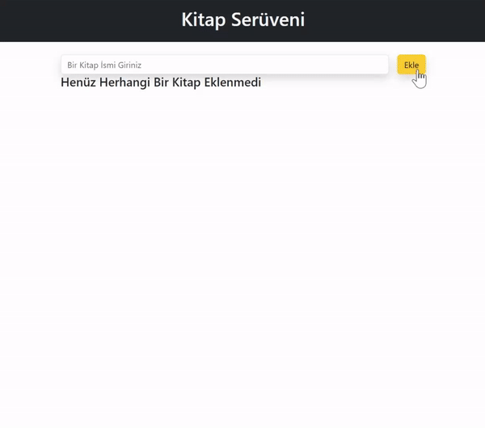

<h1> Kitap Serüveni</h1>

Bu React uygulaması kullanıcının kitaplarını takip etmeye yönelik bir basit kitap takip uygulamasıdır.

<h2> Özellikler </h2>

<ul>
<li>Kitap Ekleme</li>
<li>Kitap İsmi Düzenleme</li>
<li>Kitap Silme</li>
<li>Kitapları Okundu Olarak İşaretleme</li>
</ul>

<h2> Kullanilan Teknolojiler </h2>
<ul>
<li>React</li>
<li>React-Toastify</li>
<li>Uuid</li>
<li>JavaScript</li>
<li>HTML</li>
<li>Css</li>

</ul>

<h2> Bileşenler </h2>
<h4>Header Bileşeni</h4>
<ul>
<li> Başlık alanını temsil eder.</li>
 </ul>
<h4>BookCard Bileşen</h4>
<ul>
<li>Her bir kitabı gösteren kart bileşeni.</li>
</ul>
<h4>DeleteModal Bileşeni</h4>
<ul>
<li>Kitap silme işlemi için onay modalı.</li>
</ul>
<h4>EditModal Bileşeni</h4>
<ul>
<li>Kitap düzenleme işlemi için modal.</li>
</ul>

<h2>Ekran Görüntüsü</h2>

